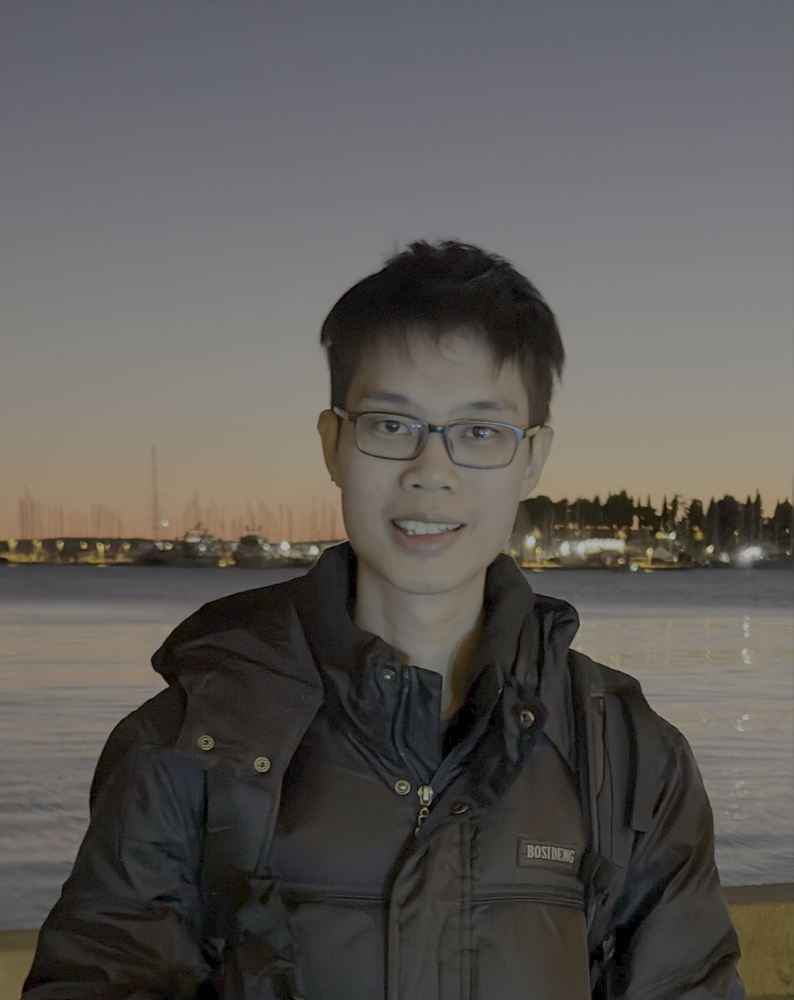
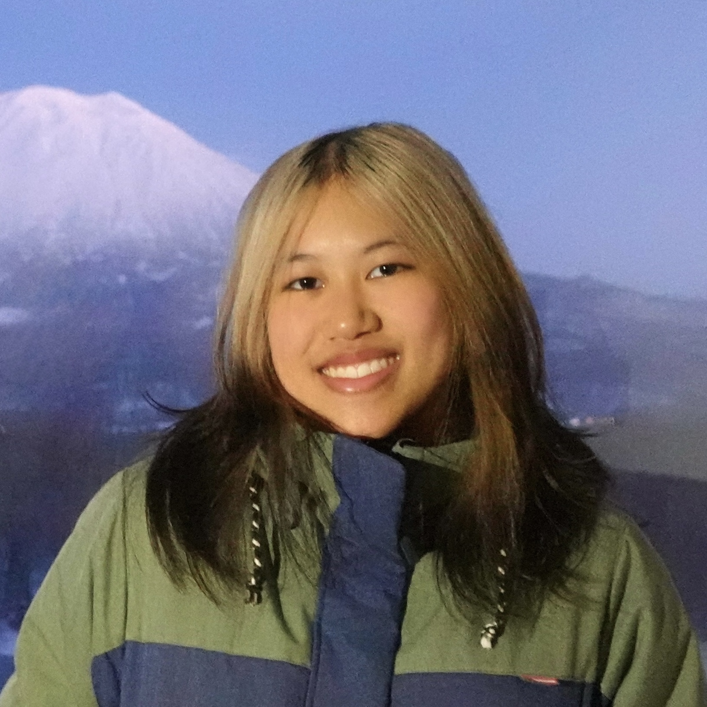
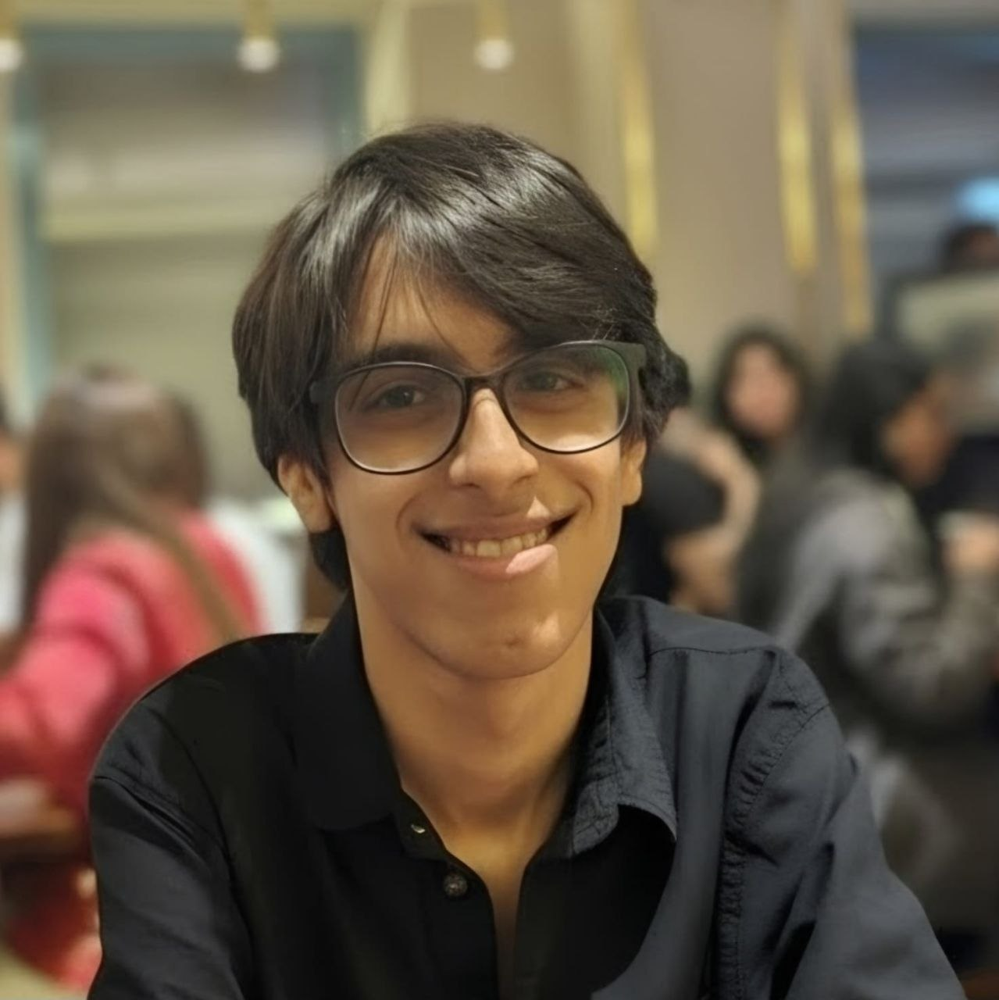

We are a team based in the [School of Computing, National University of Singapore](https://www.comp.nus.edu.sg).

You can reach us at the email `seer[at]comp.nus.edu.sg`

## Project team

### Benedict Woo

[[homepage](https://benthecat.com)]
[[github](https://github.com/benwoo1110)]

* Role: Project Advisor

### Melody

[[github](https://github.com/melogens)]

* Role: Team Lead
* Responsibilities: UI

### Johnny Doe

[[github](http://github.com/johndoe)] [[portfolio](team/johndoe.md)]

* Role: Developer
* Responsibilities: Data

### Jean Doe

[[github](http://github.com/johndoe)]
[[portfolio](team/johndoe.md)]

* Role: Developer
* Responsibilities: Dev Ops + Threading

### Aarav Malani

[[github](http://github.com/AaravMalani)]

* Role: Developer
* Responsibilities: UI
