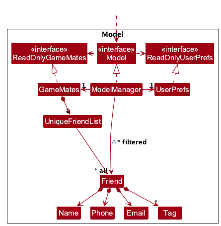
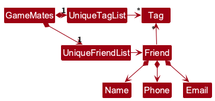

* Table of Contents
{:toc}

--------------------------------------------------------------------------------------------------------------------

## **Acknowledgements**

* _{List the sources of reused or adapted ideas, code, documentation, and third-party libraries here, with links to the originals.}_

--------------------------------------------------------------------------------------------------------------------

## **Setting up, getting started**

Refer to the guide [_Setting up and getting started_](SettingUp.md).

--------------------------------------------------------------------------------------------------------------------

## **Design**

:bulb: **Tip:** The `.puml` files used to create diagrams are in `docs/diagrams`. Refer to the [_PlantUML Tutorial_ at se-edu/guides](https://se-education.org/guides/tutorials/plantUml.html) to learn how to create and edit diagrams.

### Architecture

The ***Architecture Diagram*** given above explains the high-level design of the App.

The following provides a quick overview of the main components and their interactions.

**Main components of the architecture**

**`Main`** (consisting of classes [`Main`](https://github.com/se-edu/addressbook-level3/tree/master/src/main/java/seedu/address/Main.java) and [`MainApp`](https://github.com/se-edu/addressbook-level3/tree/master/src/main/java/seedu/address/MainApp.java)) is in charge of the app launch and shut down.
* At app launch, it initializes the other components in the correct sequence, and connects them up with each other.
* At shut down, it shuts down the other components and invokes cleanup methods where necessary.

The bulk of the app's work is done by the following four components:

* [**`UI`**](#ui-component): The UI of the App.
* [**`Logic`**](#logic-component): The command executor.
* [**`Model`**](#model-component): Holds the data of the App in memory.
* [**`Storage`**](#storage-component): Reads data from, and writes data to, the hard disk.

[**`Commons`**](#common-classes) represents a collection of classes used by multiple other components.

**How the architecture components interact with each other**

The *Sequence Diagram* below shows how the components interact with each other for the scenario where the user issues the command `delete 1`.

Each of the four main components (also shown in the diagram above),

* defines its *API* in an `interface` with the same name as the Component.
* provides its functionality through a concrete `{Component Name}Manager` class that implements the corresponding API interface.

For example, the `Logic` component defines its API in `Logic.java` and implements it in `LogicManager.java`. Other components interact with a component through its interface rather than its concrete class, preventing them from coupling to that component's implementation, as illustrated in the following partial class diagram.

The sections below give more details of each component.

### UI component

The **API** of this component is specified in [`Ui.java`](https://github.com/se-edu/addressbook-level3/tree/master/src/main/java/seedu/address/ui/Ui.java)

The UI consists of a `MainWindow` and its parts, such as `CommandBox`, `ResultDisplay`, `PersonListPanel`, and `StatusBarFooter`. All of these, including `MainWindow`, inherit from the abstract `UiPart` class, which captures common behavior among classes that represent visible GUI parts.

The `UI` component uses the JavaFX UI framework. The layouts of these UI parts are defined in matching `.fxml` files in `src/main/resources/view`. For example, [`MainWindow.fxml`](https://github.com/se-edu/addressbook-level3/tree/master/src/main/resources/view/MainWindow.fxml) specifies the layout of [`MainWindow`](https://github.com/se-edu/addressbook-level3/tree/master/src/main/java/seedu/address/ui/MainWindow.java).

The `UI` component,

* executes user commands using the `Logic` component.
* listens for changes to `Model` data so that the UI can be updated with the modified data.
* keeps a reference to the `Logic` component, because the `UI` relies on the `Logic` to execute commands.
* depends on some classes in the `Model` component because it displays `Person` objects from the model.

### Logic component

**API** : [`Logic.java`](https://github.com/se-edu/addressbook-level3/tree/master/src/main/java/seedu/address/logic/Logic.java)

Here's a (partial) class diagram of the `Logic` component:

The sequence diagram below illustrates the interactions within the `Logic` component, taking `execute("delete 1")` API call as an example.

:information_source: **Note:** The lifeline for `DeleteCommandParser` should end at the destroy marker (X), but due to a limitation of PlantUML, it continues to the end of the diagram.

How the `Logic` component works:

1. When `Logic` is called upon to execute a command, the command is passed to an `AddressBookParser` object, which in turn creates a parser that matches the command (e.g., `DeleteCommandParser`) and uses it to parse the command.
1. This results in a `Command` object (more precisely, an object of one of its subclasses e.g., `DeleteCommand`) which is executed by the `LogicManager`.
1. The command can communicate with the `Model` when it is executed (e.g. to delete a person). 
   Note that although this is shown as a single step in the diagram above for simplicity, the code can require several interactions between the command object and the `Model` to complete the operation.
1. The result of the command execution is encapsulated as a `CommandResult` object which is returned from `Logic`.

Here are the other classes in `Logic` (omitted from the class diagram above) that are used for parsing a user command:

How the parsing works:
* When called upon to parse a user command, the `AddressBookParser` class creates an `XYZCommandParser` (`XYZ` is a placeholder for the specific command name, e.g., `AddCommandParser`). The parser uses the other classes shown above to parse the user command and create an `XYZCommand` object (e.g., `AddCommand`). The `AddressBookParser` returns that object as a `Command` object.
* All `XYZCommandParser` classes, such as `AddCommandParser` and `DeleteCommandParser`, implement the `Parser` interface so they can be treated similarly where appropriate, for example during testing.

### Model component
**API** : [`Model.java`](https://github.com/se-edu/addressbook-level3/tree/master/src/main/java/seedu/address/model/Model.java)

The `Model` component,

* stores the address book data i.e., all `Person` objects (which are contained in a `UniquePersonList` object).
* stores the `Person` objects selected by the current filter, such as search results, in a separate _filtered_ list. It exposes this list as an unmodifiable `ObservableList<Person>` that the UI can observe and bind to, so the UI updates when the list changes.
* stores a `UserPrefs` object that represents the user’s preferences (currently, just the GUI settings). This is exposed to the outside as a `ReadOnlyUserPrefs` object.
* does not depend on any of the other three components (as the `Model` represents data entities of the domain, they should make sense on their own without depending on other components)

:information_source: **Note:** The alternative, arguably more object-oriented, design below keeps a unique list of tags in `AddressBook`, and each `Person` references tags from that list. This lets `AddressBook` maintain one `Tag` object per unique tag instead of each `Person` holding its own `Tag` objects. 

### Storage component

**API** : [`Storage.java`](https://github.com/se-edu/addressbook-level3/tree/master/src/main/java/seedu/address/storage/Storage.java)

The `Storage` component,
* can save both address book data and user preference data in JSON format, and read them back into corresponding objects.
* is implemented by `StorageManager`, which delegates the actual JSON file access to `JsonAddressBookStorage` and `JsonUserPrefsStorage` (one class per data file).
* depends on some classes in the `Model` component (because the `Storage` component's job is to save/retrieve objects that belong to the `Model`)

### Common classes

Classes used by multiple components are in the `seedu.address.commons` package.

--------------------------------------------------------------------------------------------------------------------

## **Implementation**

This section describes some noteworthy details on how certain features are implemented.

### \[Proposed\] Undo/redo feature

#### Proposed Implementation

The proposed undo/redo mechanism is facilitated by `VersionedAddressBook`. It extends `AddressBook` with an undo/redo history, stored internally as an `addressBookStateList` and `currentStatePointer`. Additionally, it implements the following operations:

* `VersionedAddressBook#commit()` — Saves the current address book state in its history.
* `VersionedAddressBook#undo()` — Restores the previous address book state from its history.
* `VersionedAddressBook#redo()` — Restores a previously undone address book state from its history.

These operations are exposed in the `Model` interface as `Model#commitAddressBook()`, `Model#undoAddressBook()` and `Model#redoAddressBook()` respectively.

Given below is an example usage scenario and how the undo/redo mechanism behaves at each step.

Step 1. The user launches the application for the first time. The `VersionedAddressBook` will be initialized with the initial address book state, and the `currentStatePointer` pointing to that single address book state.

Step 2. The user executes `delete 5` command to delete the 5th person in the address book. The `delete` command calls `Model#commitAddressBook()`, causing the modified state of the address book after the `delete 5` command executes to be saved in the `addressBookStateList`, and the `currentStatePointer` is shifted to the newly inserted address book state.

Step 3. The user executes `add n/David …​` to add a new person. The `add` command also calls `Model#commitAddressBook()`, causing another modified address book state to be saved into the `addressBookStateList`.

:information_source: **Note:** If a command fails its execution, it will not call `Model#commitAddressBook()`, so the address book state will not be saved into the `addressBookStateList`.

Step 4. The user now decides that adding the person was a mistake, and decides to undo that action by executing the `undo` command. The `undo` command will call `Model#undoAddressBook()`, which will shift the `currentStatePointer` once to the left, pointing it to the previous address book state, and restores the address book to that state.

:information_source: **Note:** If the `currentStatePointer` is at index 0, pointing to the initial AddressBook state, then there are no previous AddressBook states to restore. The `undo` command uses `Model#canUndoAddressBook()` to check if this is the case. If so, it will return an error to the user rather
than attempting to perform the undo.

The following sequence diagram shows how an undo operation goes through the `Logic` component:

:information_source: **Note:** The lifeline for `UndoCommand` should end at the destroy marker (X), but due to a limitation of PlantUML, it continues to the end of the diagram.

Similarly, how an undo operation goes through the `Model` component is shown below:

The `redo` command does the opposite — it calls `Model#redoAddressBook()`, which shifts the `currentStatePointer` once to the right, pointing to the previously undone state, and restores the address book to that state.

:information_source: **Note:** If the `currentStatePointer` is at index `addressBookStateList.size() - 1`, pointing to the latest address book state, then there are no undone AddressBook states to restore. The `redo` command uses `Model#canRedoAddressBook()` to check if this is the case. If so, it will return an error to the user rather than attempting to perform the redo.

Step 5. The user then decides to execute the command `list`. Commands that do not modify the address book, such as `list`, will usually not call `Model#commitAddressBook()`, `Model#undoAddressBook()` or `Model#redoAddressBook()`. Thus, the `addressBookStateList` remains unchanged.

Step 6. The user executes `clear`, which calls `Model#commitAddressBook()`. Since the `currentStatePointer` is not pointing at the end of the `addressBookStateList`, all address book states after the `currentStatePointer` will be purged. Reason: It no longer makes sense to redo the `add n/David …​` command. This is the behavior that most modern desktop applications follow.

The following activity diagram summarizes what happens when a user executes a new command:

#### Design considerations:

**Aspect: How undo & redo execute:**

* **Alternative 1 (current choice):** Saves the entire address book.
  * Pros: Easy to implement.
  * Cons: May have performance issues in terms of memory usage.

* **Alternative 2:** Individual command knows how to undo/redo by
  itself.
  * Pros: Will use less memory (e.g. for `delete`, just save the person being deleted).
  * Cons: We must ensure that the implementation of each individual command is correct.

_{more aspects and alternatives to be added}_

### \[Proposed\] Data archiving

_{Explain here how the data archiving feature will be implemented}_

--------------------------------------------------------------------------------------------------------------------

## **Documentation, logging, testing, dev-ops**

* [Documentation guide](Documentation.md)
* [Testing guide](Testing.md)
* [Logging guide](Logging.md)
* [DevOps guide](DevOps.md)

--------------------------------------------------------------------------------------------------------------------

## **Appendix: Requirements**

### Product scope

**Target user profile**:

* Play multiple online or multiplayer games.
* Have many gaming friends across different games or platforms.
* Want to remember each friend's in-game usernames, preferred roles, servers, play styles, or other game-specific details.
* Prefer using a command-line interface over navigating menus and mouse interactions.
* Prefers a desktop application for managing gaming contacts.
* Is comfortable typing commands to manage information quickly.
* Still wants a simple visual interface to view their friend and game information clearly.

**Value proposition**: Manage gaming friends and their game-specific details faster than generic contacts apps, spreadsheets, or chat history searches.

### User stories

Priorities: High (must have) - `* * *`, Medium (nice to have) - `* *`, Low (unlikely to have) - `*`

| Priority | As a …​                          | I want to …​                                            | So that I can…​                                                   |
|----------|----------------------------------|--------------------------------------------------------|------------------------------------------------------------------|
| `* * *`  | new user                         | see usage instructions                                 | refer to instructions when I forget how to use the App           |
| `* * *`  | gamer                            | add a gaming friend                                    | remember the people I play games with                            |
| `* * *`  | gamer                            | delete a friend                                        | remove friends I no longer play with                             |
| `* * *`  | gamer                            | list all my friends                                    | see everyone I have saved at a glance                            |
| `* * *`  | gamer                            | edit a friend's details                                | keep their information up to date                                |
| `* * *`  | gamer                            | add games to a friend's entry                          | remember what games they play                                    |
| `* * *`  | gamer                            | remove games from a friend's entry                     | know which games they no longer play                             |
| `* * *`  | gamer                            | add a friend's in-game username for a game or platform | know what name to search for when inviting them                  |
| `* * *`  | gamer                            | edit a friend's platform handle                        | keep it up to date when they change their username               |
| `* * *`  | gamer                            | search for a friend by name                            | find the people I want without scrolling through the whole list  |
| `* * *`  | gamer                            | filter my friends by game or platform                  | quickly find friends relevant to what I am currently playing     |
| `* * *`  | gamer                            | add my own details                                     | see how I fit into the context of my friends                     |
| `* * *`  | gamer                            | edit my own details                                    | keep my profile accurate as my games and usernames change        |
| `* * *`  | gamer                            | have my data saved automatically                       | keep my friend list after closing the App                        |
| `* *`    | gamer                            | be asked to confirm before deleting a friend           | avoid deleting someone by accident                               |
| `* *`    | gamer                            | be warned when adding a friend who already exists      | avoid duplicate entries                                          |
| `* *`    | gamer                            | see which games my friends and I have in common        | decide what to play together                                     |
| `* *`    | gamer who plays many games       | see all the games a friend plays                       | know which games I can invite them to                            |
| `* *`    | gamer                            | record a friend's preferred role (e.g. support, tank)  | put together a balanced team                                     |
| `* *`    | gamer                            | record the server or region a friend plays on          | invite only friends who can join my lobby                        |
| `* *`    | gamer                            | record a friend's rank in a game                       | find friends at a similar skill level                            |
| `* *`    | gamer                            | add notes about a friend's play style                  | remember who is casual and who is competitive                    |
| `* *`    | gamer                            | tag friends (e.g. "duo", "casual")                     | group them in ways that suit me                                  |
| `* *`    | expert user                      | use shorter command aliases                            | manage my friends even faster                                    |
| `*`      | gamer with many friends          | sort friends by name                                   | locate a friend easily                                           |
| `*`      | gamer                            | mark friends as favourites                             | find my regular teammates first                                  |
| `*`      | gamer with friends abroad        | record a friend's time zone                            | know when they are likely to be online                           |
| `*`      | gamer                            | undo my last command                                   | recover from mistakes quickly                                    |
| `*`      | gamer                            | record when I last played with a friend                | reconnect with friends I have not played with in a while         |
| `*`      | gamer                            | export my friend list                                  | back up my data or move it to another computer                   |

### Use cases

(For all use cases below, the **System** is `GameMates` and the **Actor** is the `user`, unless specified otherwise)

**Use case: Add a friend**

**MSS**
1. User requests to add a friend, providing a name.
2. GameMates adds the friend to the list and shows a confirmation.

   Use case ends.

**Extensions** 
* 1a. The name field is missing or empty.

  * 1a1. GameMates shows an error message.
    
    Use case ends.
* 1b. A friend with the same name already exists.

  * 1b1. GameMates shows an error message, suggesting the user search first.
    
    Use case resumes at step 1.

**Use case: Delete a friend**

**MSS**
1. User requests to list friends.
2. GameMates shows a list of friends.
3. User requests to delete a specific friend in the list.
4. GameMates asks for confirmation.
5. User confirms.
6. GameMates deletes the friend.

   Use case ends.

**Extensions**
* 2a. The list is empty.
  
  Use case ends.
* 3a. The given index is invalid.

  * 3a1. GameMates shows an error message.
    
    Use case resumes at step 2.
* 5a. User does not confirm.
  
  Use case ends.

**Use case: Edit a friend's platform handle**

**MSS**
1. User requests to list friends.
2. GameMates shows a list of friends.
3. User requests to edit a specific friend's handle for a platform, providing the new handle.
4. GameMates updates the handle and shows a confirmation.

   Use case ends.

**Extensions**
* 2a. The list is empty.
  
  Use case ends.
* 3a. The given index is invalid.

  * 3a1. GameMates shows an error message.
    
    Use case resumes at step 2.
* 3b. The specified platform does not exist for that friend.

  * 3b1. GameMates shows an error message.
    
    Use case resumes at step 2.

**Use case: Search for a friend**

**MSS**
1. User requests to search for friends matching a keyword.
2. GameMates shows a list of friends matching the keyword.

   Use case ends.

**Extensions**
* 1a. No keyword is given.

  * 1a1. GameMates shows an error message.
    
    Use case ends.
* 2a. No friends match the keyword.
  
  Use case ends.

**Use case: Filter friends by game**

**MSS**
1. User requests to filter friends by a specific game.
2. GameMates shows a list of friends who play that game.

   Use case ends.

**Extensions**
* 2a. No friends play that game.
  
  Use case ends.

### Non-Functional Requirements

#### Environment

1. Should work on any _mainstream OS_ as long as it has Java `25` or above installed.
1. Should work offline on a single user's personal laptop, without requiring an internet connection or any installed software other than Java `25` or above.
1. Should work on screens with a resolution of `1280 x 720` or higher, with all panels and the command box visible without scrolling the window at its default size.

#### Data

1. All data should be stored locally in a human-editable JSON file. GameMates should not send any data over the network.
1. Data saved on exit should be fully restored on the next launch, with no loss of friends, game entries or metadata, provided the data file is not edited manually into an invalid format.
1. If the data file is missing, GameMates should start with the sample data without crashing. If the data file is corrupted, GameMates should start with an empty list without crashing.

#### Capacity

1. Should be able to hold up to 1000 friends, each with up to 100 game entries.

#### Performance

1. GameMates should be ready to accept commands within 3 seconds of starting the application on a _modern computer_ running Java `25`, with up to 1000 friends and 100 game entries per friend.
1. GameMates should display the results of each friend listing or filtering command within 2 seconds of submission on a _modern computer_ running Java `25`, with up to 1000 friends and 100 game entries per friend.

#### Usability

1. A user with above average typing speed for regular English text (i.e. not code, not system admin commands) should be able to add, edit, delete, list and filter friends, and add, delete and list game entries, faster using commands than using the mouse.
1. A first-time user should be able to add a friend and add a game entry to that friend within 5 minutes of first launching GameMates, using only the in-app help and the sample data as a reference.
1. Every invalid command should produce an error message that states what was wrong and shows the correct usage or allowed input range, and should not modify any data.
1. Every command described in the User Guide should be usable through the command box alone, without needing the mouse.

#### Constraints

1. GameMates does not verify friend names, game names, usernames or metadata against any online gaming platform. All such data is whatever the user enters.

### Glossary

* **Modern computer**: A computer running a mainstream OS with 16 GB of RAM, a 512 GB SSD, and a mid-range modern processor such as an Intel Core i5 or AMD Ryzen 5.
* **Mainstream OS**: Windows, Linux, Unix, or macOS
* **Friend**: A person stored in GameMates, identified by a unique name and optionally associated with contact details and game entries.
* **User profile**: The current user’s own stored details. It is edited when `edit` is used without a friend index.
* **Game entry**: A record that a particular friend plays a particular game, including their in-game username and optional metadata.
* **Role**: A job or duty a friend plays as in a particular game, for example a friend can play as a `Sniper` or a `Healer`.
* **Game name**: The user-provided name used to identify a game within one friend’s game entries. Aliases such as “Val” and “Valorant” are treated as different game names.
* **In-game username/Handle**: The name/alias a friend uses within a particular game. It may not refer to their real name and can be different for different games.
* **Metadata**: Optional additional information recorded for a game entry, such as a role, preferred weapon, server, or play style.
* **Metadata key**: The label before the first colon in a metadata item. For example, `Role` in `Role:Sentinel`.
* **Metadata value**: The information after the first colon in a metadata item. For example, `Sentinel` in `Role:Sentinel`.
* **Friend index**: A positive number representing a friend’s position in the currently displayed friend list.
* **Currently displayed list**: The friend list currently shown after any active filters have been applied. Friend indices refer to this list.
* **Filter**: A condition used to narrow a displayed list, such as a name keyword or game name.
* **Name keyword**: A word used to match part of a friend’s name.
* **Case-insensitive comparison**: A comparison that treats uppercase and lowercase letters as equivalent.
* **Trimmed value**: A value after its leading and trailing spaces have been removed.
* **Duplicate**: Two entries considered the same according to the project’s matching rules, and therefore not both allowed.

--------------------------------------------------------------------------------------------------------------------

## **Appendix: Instructions for manual testing**

Given below are instructions to test the app manually.

:information_source: **Note:** These instructions only provide a starting point for testers to work on;
testers are expected to do more *exploratory* testing.

### Launch and shutdown

1. Initial launch

   1. Download the JAR file and copy it into an empty folder.

   1. Double-click the JAR file. 
      Expected: The GUI opens with a set of sample contacts. The window size may not be optimal.

1. Saving window preferences

   1. Resize the window to an optimal size. Move the window to a different location. Close the window.

   1. Relaunch the app by double-clicking the JAR file. 
       Expected: The most recent window size and location are retained.

1. _{ more test cases …​ }_

### Deleting a person

1. Deleting a person while all persons are being shown

   1. Prerequisites: List all persons using the `list` command, with multiple persons in the list.

   1. Test case: `delete 1` 
      Expected: The first contact is deleted from the list. The status message shows the deleted contact's details.

   1. Test case: `delete 0` 
      Expected: No person is deleted. The status message shows error details.

   1. Other incorrect delete commands to try: `delete`, `delete x`, `...` (where x is larger than the list size) 
      Expected: Similar to previous.

1. _{ more test cases …​ }_

### Saving data

1. Dealing with missing/corrupted data files

   1. _{Explain how to simulate missing or corrupted data files and state the expected behavior.}_

1. _{ more test cases …​ }_
